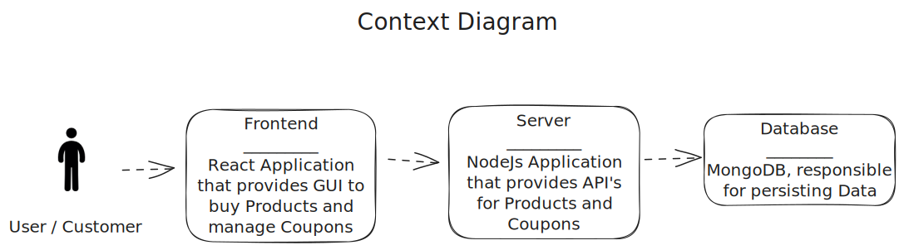

# Bewerbungsaufgabe

---

## Overview
This project is a job Application Task. The primary objectives are to implement a product display frontend and create a backend application in Node.js to manage discount codes.

## C4 System ContextDiagram


## Technologies Used
- Frontend: HTML, CSS, JavaScript, React.
- Backend: Node.js, Express, MongoDB.
- Container: Docker

___

## Tasks
### Task 1: Frontend Product Display
Create a responsive and user-friendly frontend application to display a list of products. The frontend should provide the following features:
- Product Listing: Display a list of products with relevant details such as image, name, price, to details and buy button.


### Task 2: Backend Discount Code Management
Build a backend application in Node.js to handle the management of discount codes. The backend should offer the following functionalities:

- CRUD Operations: Implement Create, Read, Update, and Delete operations for discount codes.
- Validation: Ensure proper validation for discount code creation and modification.
- API Endpoints: Define clear API endpoints for interacting with the discount code management system.
- DB Schema: Implement an efficient DB Schema to create and handle discount codes.

___

## Getting Started

This Project uses node version 18 and npm version 8.

If You have [nvm](https://github.com/nvm-sh/nvm) installed, simply type ``nvm use`` to set node version via .nvmrc file

Start the mongo DB via:
```
docker compose --env-file .env.local up
```
Start the frontend via:
```
cd ./frontend && npm run start
```
Start the backend via:
```
cd ./server && npm run dev
```

TODO: docker-compose um frontend und backend container erweitern


## HTTP Files
To test single API endpoints I use Jetbrains [HTTP Client](https://www.jetbrains.com/help/idea/http-client-in-product-code-editor.html).
You can find some of those in the [http-requests directory](./assets/http-requests)


## API
You can find the API Documentation under http://localhost:8080/api-docs/ (Server needs to be running)
___

## Resources: 
Icons: 
https://de.freepik.com/icon/begrenzt_5212124
https://de.freepik.com/icon/stehender-mann_10522#fromView=search&term=person&page=1&position=4&track=ais&uuid=d3caba72-bbb2-486a-8fcf-953535eff0ed